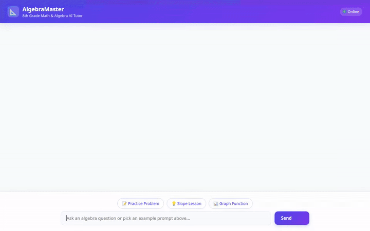

# 📐 AlgebraMaster — 8th Grade Math & Algebra Tutor Agent

An intelligent, interactive AI tutor built with the **Google Agent Development Kit (ADK)** and deployed on **Google Cloud Agent Platform**. **AlgebraMaster** helps middle school and 8th-grade students master linear equations, slope-intercept form, graphing, and algebraic concepts through dynamic visual diagrams, video generation, practice quizzes, and curriculum textbook search.



---

## 🌟 Core Features

- **📚 Curriculum Textbook Search**: Queries Cloud Firestore database containing 8th Grade Math & Algebra curriculum topics, lessons, and textbook excerpts.
- **📊 Dynamic Coordinate Graph & Diagram Generator**: Generates mathematical plots (e.g. $y = mx + b$, coordinate grids) using Matplotlib, uploads images directly to Cloud Storage, and saves them as session artifacts.
- **🎥 AI Video Generation (`gemini-omni-flash-preview`)**: Uses Google's Omni model in the `global` region to generate short educational concept animations, uploaded directly to Google Cloud Storage.
- **🎴 Interactive A2UI Cards**: Renders rich interactive UI cards for practice quizzes, topic breakdowns, and lesson steps.
- **🧠 Memory Bank Integration**: Persists student learning session history using Vertex AI Session Memory callbacks so the agent remembers student progress.
- **🧮 Math Expression Evaluator**: Evaluates algebraic expressions and equations safely.
- **📝 Practice Quiz Generator**: Creates multi-choice practice problems tailored to 8th-grade algebra standards.

---

## 🛠️ Google Cloud Services & Technologies Wired

| Service / Technology | Implementation Purpose |
| --- | --- |
| **Google ADK (Agent Development Kit)** | Core agent architecture, tools registration, and execution flow |
| **Vertex AI Reasoning Engines / Agent Platform** | Managed runtime host for the `algebramaster-agent` |
| **Gemini Models (`gemini-flash-latest`, `gemini-omni-flash-preview`)** | Main reasoning agent model and global-region Omni video generation model |
| **Cloud Firestore** | Storage and retrieval of curriculum textbooks, topics, and lesson data |
| **Google Cloud Storage (GCS)** | Public asset storage bucket for generated coordinate graphs and educational videos |
| **Vertex AI Memory Bank** | Session memory persistence callback via `add_session_to_memory` |
| **Cloud Run** | Containerized deployment of the FastAPI proxy and chat user interface |

---

## 📋 Status of Planned Features

- ✅ **Curriculum Topic & Textbook Search**: *Fully Implemented* (Firestore integration)
- ✅ **Dynamic Diagram & Plot Generation**: *Fully Implemented* (Matplotlib + GCS direct bytes upload)
- ✅ **Omni Model Educational Video Generation**: *Fully Implemented* (`gemini-omni-flash-preview` global region + GCS)
- ✅ **Interactive A2UI Quiz Cards**: *Fully Implemented* (`a2ui_callback` & custom frontend card renderer)
- ✅ **Session Memory Persistence**: *Fully Implemented* (`PreloadMemoryTool` & `generate_memories_callback`)
- ⏳ **Adaptive AI Grading & Automated Homework Scanner**: *Planned, not yet implemented*

---

## 🚀 Local Setup & Running Instructions

### Prerequisites

- **Python 3.11+**
- **uv** package manager (`pip install uv`)
- **Google Cloud SDK** (`gcloud`) authenticated with a GCP project

### 1. Installation

Clone the repository and install dependencies:

```bash
cd algebramaster-agent
uv sync
```

### 2. Environment Configuration

Set the required environment variables:

```bash
export GOOGLE_CLOUD_PROJECT="<your-gcp-project-id>"
export GOOGLE_CLOUD_LOCATION="us-east1"
export AGENT_ENGINE_RESOURCE_NAME="<your-agent-platform-resource-name>"
export AGENT_DIRECTORY="app"
```

### 3. Run the Agent Engine Locally

To test the agent engine directly:

```bash
uv run python -m app.agent
```

### 4. Run the Chat Frontend Locally

Navigate to the `frontend` folder and start the FastAPI proxy server:

```bash
cd frontend
pip install -r requirements.txt
python main.py
```

Open your browser to the local server port printed in the terminal output to chat with **AlgebraMaster**!

---

## 🧪 Deploying to Cloud Run & Agent Platform

### Deploy the Agent to Agent Platform:

```bash
uv run agents-cli deploy --no-confirm-project
```

### Deploy the Chat Frontend to Cloud Run:

```bash
gcloud run deploy algebramaster-frontend \
  --source ./frontend \
  --region us-east1 \
  --set-env-vars AGENT_ENGINE_RESOURCE_NAME="<your-agent-resource-name>",AGENT_DIRECTORY="app" \
  --allow-unauthenticated
```
